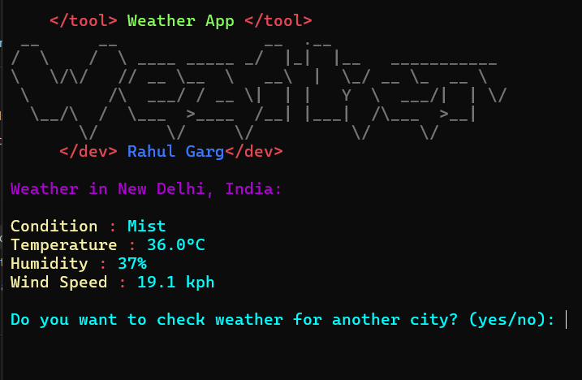

# Weather_app
**Weather App CLI**

Welcome to the Weather App CLI! This command-line interface (CLI) application allows you to check the current weather conditions for any city around the world.

### Features

- **Real-Time Weather:** Get up-to-date weather information including temperature, humidity, and wind speed.
- **Location-Based:** Enter the name of any city to retrieve its weather forecast.
- **User-Friendly Interface:** Intuitive CLI design for easy navigation and usage.

### Installation

To run the Weather App CLI, follow these steps:

1. Clone this repository:
   ```bash
   git clone https://github.com/rahulgarg2206/weather-app-cli.git
   ```

2. Navigate to the project directory:
   ```bash
   cd weather-app-cli
   ```

3. Install dependencies:
   ```bash
   pip install illusionanime illusioncolor requests
   ```

4. Run the application:
   ```bash
   python weather_app.py
   ```

### Usage

1. Upon running the application, you will be prompted to enter the name of the city for which you want to check the weather.
2. After entering the city name, the application will display the current weather conditions for that city, including temperature, humidity, and wind speed.

### Dependencies

- **illusionanime:** A Python library for displaying anime-style text in the command line interface.
- **illusioncolor:** A Python library for adding colors to text in the command line interface.
- **requests:** A Python library for making HTTP requests.


### Acknowledgements

- This Weather App CLI was created by Rahul Garg.
- Special thanks to the creators of illusionanime and illusioncolor libraries for enhancing the CLI experience.

## Screenshots

</img>

## [+] Find Me On :

[](https://www.instagram.com/rahulgarg__09?igsh=MTh5ZnNmMnRicGw5dg==)
[](https://t.me/cyberrj09)


## Visiter


